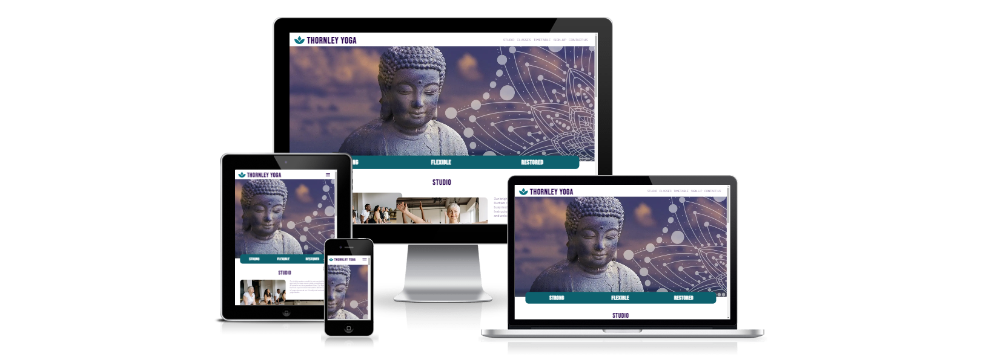
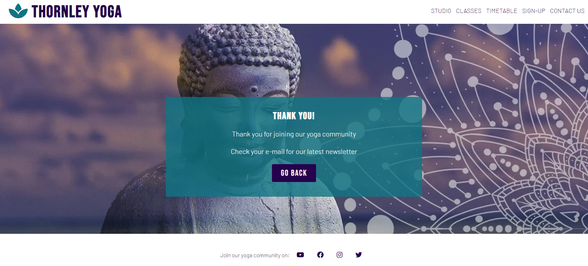
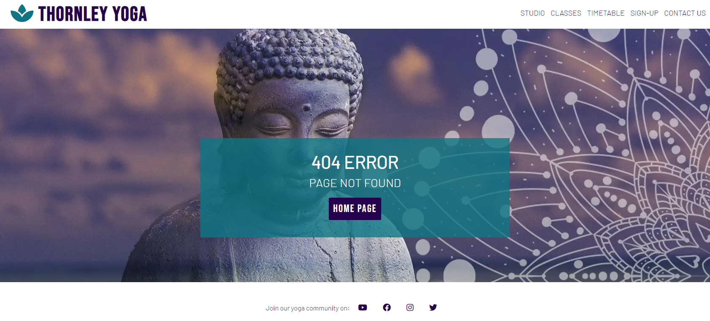
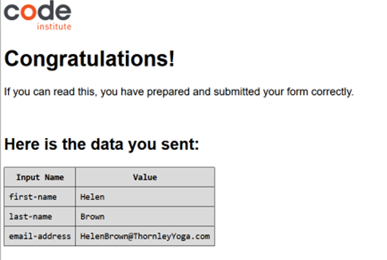
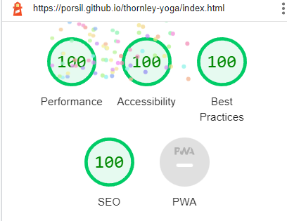

# <h1 align="center">**THORNLEY YOGA**</h1>

[View the live project here](https://porsil.github.io/thornley-yoga/index.html)

This is the static website for Thornley Yoga. A responsive website designed to be accessible on a range of devices, allowing the information to be found easily.

-   ### **Visitor Goals**

1. Clearly understand the purpose of the site and easily navigate the site to find content, on any screen size.
2. To find information on the studio and instructors.
3. To learn about the classes available and the benefits of the different yoga styles.
4. To get the times of when the different yoga classes are run.
5. To sign up to a monthly newsletter to be e-mailed updates, changes and special offers.
6. To find the best way to get in contact with the studio to ask questions.
7. To find social media links to the yoga community.

-   ### **Wireframes**

    -   Browser Wireframe - [View](assets/read-me-docs/thornley-yoga-browser.pdf)
    -   Tablet Wireframe - [View](assets/read-me-docs/thornley-yoga-tablet.pdf)
    -   Mobile Wireframe - [View](assets/read-me-docs/thornley-yoga-mobile.pdf)
    
-   ### **Design**

    -   The two main colours used are purple and teal.
    -   The main font used throughout the website is Barlow, with Bebas Neue used for the logo, section headers and the sign-up button. These fonts are clean fonts and complement each other well.
    -   In case the fonts do not import into the website correctly, Sans Serif was used as the backup font.
    -   A large hero image is used to catch the user's attention and to promote a sense of calm.

-   ## **Existing Features**

-   **Navigation Bar**

    -   Alongside the logo of the site, the navigation bar is located at the top of the site with the links arranged horizontally allowing different sections to be easily accessed by the user. The site logo itself is a clickable link to the home page.
    -   This addresses visitor goal 1.

-   **Landing Page Image**

    -   The landing includes a calming Buddha image, to give the user a sense of what yoga is about and includes a tag line to show visitors the positive outcome of practising yoga here.
    -   This addresses visitor goal 1.

-   **Studio Section**

    -   The studio section will allow the user to learn some basic information about the yoga studio and the experience of practising yoga here.
    -   This section will explain to the user that all experience levels are catered for to encourage all user levels to consider practising at the studio.
    -   Included are supporting images of the yoga studio to allow the user to see what the studio and classes look like.
    -   This addresses visitor goal 2.

    

-   **Classes Section**

    -   The classes section will allow the user to learn about the different classes on offer at the studio and the benefits of each class.
    -   This addresses visitor goal 3.

-   **Timetable Section**

    -   The timetable section will allow the user to see precisely what time each class will happen.
    -   This section will be updated if the class timetable changes to keep the user up to date.
    -   This addresses visitor goal 4.

-   **Sign-up Section**

    -   The sign-up section will allow the user to sign-up to the studio's monthly newsletter and be a part of the community by submitting their full name and e-mail address.
    -   Signing-up will also allow the user to receive any special offers for the studio.
    -    On clicking the sign-up button, the user is directed to a thank-you page to indicate successful submission of the form and offers a button to go back to the home page. This page keeps the header, hero image and footer from the home page for consistency and allows for easy navigation to all sections of the website.
    -   This addresses visitor goal 5.

-   **Contact-Us Section**

    -   The contact-us section will give the user the information required to get in touch with or visit the studio.
    -   Three methods of communication are given: telephone, e-mail and address.
    -   This addresses visitor goal 6.

-   **Footer**

    -   The footer section will allow users to view the social media pages of the studio by providing links to the relevant social media sites.
    -   All links will open via a new tab to give user friendly navigation.
    -   The footer will encourage users to join the community by keeping connected through social media.
    -   This addresses visitor goal 7.

-   **404 Page**

    -   A 404 error page was created to notify the user if they attempted to navigate to a page or file that does not exist.
    -   This page offers a button to return to the home page and keeps the header, hero image and footer from the home page for consistency and allows for easy navigation to all sections of the website.

    
-   **Features Left to Implement**

    -   A costings section to allow the user to see the prices of joining the studio. This was not part of the initial design but would be beneficial to site users. To allow the site to not contain too much contact on the one page, the timetable and costings could be moved to a separate page on the site.
    -   An embedded map to show the location of the studio in the contact us section. This was in the initial design but was not implemented in the project due to the aesthetics of the page with an embedded map. To add a map to the website, the contact-us section could be moved to a separate page on the site.

-   ## **Responsiveness**

The website is responsive on all device sizes and to maximise the websites visual appeal and useability of the site, this addresses visitor goal 1. There are three 'breakpoints':

-   **876px and above**

    -   The navigation links are listed horizontally, the studio section contains three pictures around two blocks of text, the classes are listed horizontally and the timetable is shown in three columns.

-   **651px to 875px**

    -   The navigation links are provided via a hamburger menu, in the studio section the middle picture is removed, the classes are listed vertically and the timetable is shown in two columns.

-   **650px and below**

    -   The studio section is now shown vertically with the two text blocks shown between the two pictures and the timetable is shown in one column.

-   ## **Technologies Used**

-   **Languages Used**

    -   HTML5
    -   CSS3

-   **Frameworks, Libraries & Programs Used**

    -   [Google Fonts](https://fonts.google.com/) were used to import the 'Barlow' and 'Bebas Neue' fonts into the style.css file. These fonts are used throughout all pages of the website.
    -   [Font Awesome](https://fontawesome.com/) was used throughout all pages of the website for the logo graphic in the header and the social media icons in the footer.
    -   [Gitpod](https://gitpod.io/) was used for version control by utilizing the Gitpod terminal to commit to Git and push to [Github](https://github.com/) which then stored the project code.
    -   [Balsamiq](https://balsamiq.com/) was used to create the wireframes when designing the website.

-   ## **Testing**

The site was frequently tested during development on Firefox, Google Chrome and Microsoft Edge browsers and included the testing of links and the registration form. Testing also included using the development tools to view the sites layout on different devices as well as using the 'responsive' setting to see at what sizes the layout became distorted.

Before the thank-you page was added to the website for completion of the sign-up form, the code was set to submit the form to the Code Institute form dump. 

Once the testing verified the form was submitting the information as required the submit button was changed to be a link to the form-submitted.html page for aesthetic purposes.

Once deployed the website was tested on Firefox, Google Chrome and Microsoft Edge browsers on a desktop. The website was also tested on a Kindle Fire and iPhone12, in both portrait and landscape.

Testing of the website was also performed by family on a Samsung Galaxy Tab A and a Samsung Galaxy J5 to aid in the discovery of bugs and user experience issues.

-   **Bugs**

    -   In the classes section the three `
` elements were not difficult to keep in equal thirds once the margins and padding was added to the CSS code. This was fixed using box-sizing: border-box; taken from the Code Institute Love Running walkthrough project.
    
    -   Initially the studio section was behaving differently on different browsers, and was hard to maintain integrity as the screen size changed. This resulted in many media queries to allow the site to be viewed satisfactorily on different screen sizes. The studio section was updated to use display: flex; which allowed the section to be displayed correctly on the three different browsers.

    -   In the classes section the height of the three `
` elements changed at different times when the screen size was changed because the text broke onto a new line at different sizes. This was fixed by adding a container div in the HTML code and using display: flex; on the container and flex: 1; on the three content `
` elements. This solution was given in this [stackoverflow post](https://stackoverflow.com/questions/2997767/how-do-i-keep-two-side-by-side-div-elements-the-same-height/20669539#20669539)
    
    -   Once deployed, it was noted that the studio link in the navigation bar no longer worked. When investigated the studio section id has been deleted in error when the above studio fix was implemented. The id was re-instated to allow the link to function correctly.

    -   Also during testing post deployment, it was noticed that the sign-up field requirements were no longer valid as the button was changed to a link to the form-submitted.html page. This was fixed by re-instating the submit button as an input and the form method changed to GET with the action linking to the form-submitted.html page.

-   **Validator Testing**

    - HTML
        -   The [official W3C HTML validator](https://validator.w3.org/) gave an error for the `
` in the navigation label stating that a div element is not allowed as a child of a label element in this context. The `
` was changed to `` to resolve the error.
    
    -   CSS
        -   When passed through the [official W3C CSS Validator](https://jigsaw.w3.org/css-validator/#validate_by_input) no errors were found.

-   **Accessibility Testing**
    
    -   Screen Readers
        -   The website was tested using Microsoft Narrator on a desktop and the VoiceOver function on an iphone12.
    
    -   WebAIM Contract Checker
        -   All colour combinations used were checked on the [WebAIM Contrast Checker](https://webaim.org/resources/contrastchecker/).
        -   The initial purple background colour chosen for the classes section, #74638D, failed the WCAG AAA test for normal text. The background purple colour was changed to a darker shade, #615374, that passed all the WCAG tests:

        

    -   Lighthouse
        -   Lighthouse reports were generated through the Google Chrome developer tools at several points during the websites development.
        -   The first report gave a performance score of 76, with the reason being the pictures file size was too large. The pictures were converted from jpeg to webp using [Ezgif](https://ezgif.com).
        -   The second report gave a performance score of 86, with the reason being the pictures were too large. The pictures were re-sized using [Ezgif](https://ezgif.com).
        -   The final report after deployment gave scores of 100 for all categories:

        

-   ## **Deployment**

-   **GitHub Pages**

The project was deployed to GitHub pages using the following steps:

   1.   Log in to GitHub and locate the GitHub repository.
   2.   Select the "Settings" button at the top of the repository.
   3.   Select the "Pages" tab on the left-hand menu to open the "GitHub Pages" section.
   4.   In the "Source" section, click the dropdown labelled "None" and select "Main".
   5.   The page will automatically refresh, and the published site link is given at the top of the "GitHub Pages" section.

-   ## **Credits**

-   **Code**

    -   The code to import the fonts was taken from [Google Fonts](https://fonts.google.com/). This was based on the Code Institute Love Running walkthrough project.

    -   The code to add the icons used in the logo and footer were taken from [Font Awesome](https://fontawesome.com/). This was based on the Code Institute Love Running walkthrough project.

    -   The CSS code to allow the classes section to remain the same height at all times was taken from this [stackoverflow post](https://stackoverflow.com/questions/2997767/how-do-i-keep-two-side-by-side-div-elements-the-same-height/20669539#20669539).

    -   The code for the hamburger menu was based on [Hamburger Menu Example](https://codepen.io/nar3nd3r/pen/GRQVZbq) written by Narender Singh.

-   **Content**

    -   The classes information was based on information from my yoga instructor Zoe Bray-Cotton at [Yoga Burn](https://yoga-burn.net/).

-   **Media**

    -   The hero Buddha image used was taken from [Pixabay](https://pixabay.com/).
    -   The three pictures used in the studio section were taken from [Pexels](https://www.pexels.com/).

-   **Acknowledgements**

    -   My Mentor Narender Singh for their knowledge and feedback.